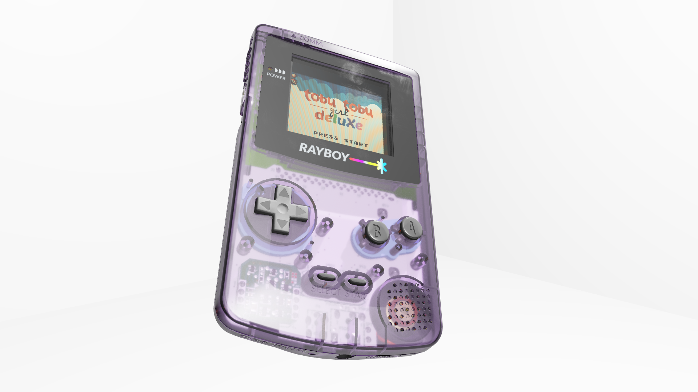

Rayboy
======



Ever wanted to choke your RTX 3090 while playing 8-bit videogames?
How about feeling the nostalgia of reflective LCDs with fat pixels?
Or do you just want free eye candy to justify your GPU?

Rayboy is that program for you!

Rayboy is a GBC emulator with ray tracing and copious detail. It uses the
[SameBoy](https://github.com/LIJI32/SameBoy) project as the emulator backend to
provide accurate GBC emulation. Therefore, Rayboy itself is mostly just a
frontend.

[Youtube demonstration video](https://www.youtube.com/watch?v=YoAKs69ZtnU)

## Download

[Download .zip for Windows](https://github.com/juliusikkala/RayBoy/releases/download/v1.0.0/RayBoy.zip)

[Download .tar.xz sources for Linux](https://github.com/juliusikkala/RayBoy/releases/download/v1.0.0/RayBoy.tar.xz)

## Features

### Graphics

Rayboy comes with two graphics modes: Plain and Fancy. Plain is just your old,
boring emulator rendering that just shows the framebuffer of the device. You
are offered the option to use more realistic colors or subpixels, though.

Fancy mode is the real deal with 3D graphics and ray tracing. It features a
**3D console model** with **animated buttons**; a **realistic reflective LCD**
that has **subpixels**, **realistic colors** and **pixel transition delays**;
and **switchable plastic shell materials.**

Ray tracing is used for real-time **soft shadows**, **reflections** and
**refractions** (when a transparent shell is used). **Temporal accumulation**
with **reprojection** is used to reduce noise in the rendered image.

Fancy mode also works without ray tracing. In that case, you will not have
shadows, and reflections come from an environment map only. Transparent console
shells are also not selectable without ray tracing.

### Audio

Rayboy has 3D stereo audio. HRTF would be nice to have someday, but the audio
library we use does not support that at least yet. It also uses the realistic
audio **filtering** provided by SameBoy.

### Input

Rayboy can be played with a keyboard and mouse or console controllers. You can
move and rotate the console, which you have to do in order to get a good
visibility on the reflective LCD. Just like in real life.

## Usage

Rayboy is a GUI program. You can find up-to-date information about controls
under [About > Controls] from the menu bar of the program.

If you want to give an initial ROM file, you can do so by passing it as the
command line parameter. This is not necessary however, since you can simply use
the GUI to load the ROM file you want to emulate.

Rayboy does not ship with game ROMs. If you're looking for games to play with it,
I recommend you give a try to [Tobu Tobu Girl Deluxe](https://tangramgames.dk/tobutobugirldx/)
by Tangram Games, it's great.

## Dependencies

Rayboy would not have been possible to make without great open source libraries.

Rayboy uses the following libraries:
- [GLM](https://github.com/g-truc/glm) for linear algebra
- [Dear ImGui](https://github.com/ocornut/imgui) for GUI
- [KTX-Software](https://github.com/KhronosGroup/KTX-Software) for loading KTX textures
- [nativefiledialog](https://github.com/mlabbe/nativefiledialog) for file select dialogs
- [SameBoy](https://github.com/LIJI32/SameBoy) for GB emulation backend
- [SDL2](https://github.com/libsdl-org/SDL) for window, input and audio handling
- [SoLoud](https://github.com/jarikomppa/soloud) for 3D audio
- [Volk](https://github.com/zeux/volk) for loading Vulkan extensions
- [Vulkan-Headers](https://github.com/KhronosGroup/Vulkan-Headers) and
  [Vulkan-Loader](https://github.com/KhronosGroup/Vulkan-Loader) for Vulkan API
- [VulkanMemoryAllocator](https://github.com/GPUOpen-LibrariesAndSDKs/VulkanMemoryAllocator) for allocating GPU memory
- [nlohmann/json](https://github.com/nlohmann/json) for the options file
- [MonkeroECS](https://github.com/juliusikkala/MonkeroECS) for handling entities in the "game"
- [stb\_image](https://github.com/nothings/stb) for loading regular textures
- [tinygltf](https://github.com/syoyo/tinygltf) for loading 3D models
- And of course, the standard C++ library on your platform of choice.

These are included as submodules or files in the repository, so you don't have
to install them separately.

## Building

This repo uses submodules, so you need to clone recursively. A submodule also
uses Git LFS for the asset files, so make sure that it is [installed before cloning.](https://docs.github.com/en/repositories/working-with-files/managing-large-files/installing-git-large-file-storage)

### Linux

```bash
git clone --recursive https://gitlab.com/juliusikkala/rayboy
cd RayBoy
cmake -S . -B release -DCMAKE_BUILD_TYPE=Release
cmake --build release
release/rayboy
```

### Windows

TODO -- you're on your own, but it should technically be possible with some
elbow grease.

## Licenses

Rayboy source code is licensed under GPLv3, see the accompanying [COPYING
file](COPYING) for details. Rayboy also uses multiple libraries. Their license
details can be found in their folders/submodules/files in the
[external](external) directory.

Information about asset licenses is available below.

## Asset credits

Copyright 2021 Julius Ikkala, under [CC BY-NC-SA 4.0](https://creativecommons.org/licenses/by-nc-sa/4.0/):
* `data/brdf_integration.ktx`
* `data/gbc_lut.png`
* `data/subpixel.png`
* `data/white_room.glb`
* `data/white_room.hdr`
* `data/white_room_irradiance.ktx`
* `data/white_room_radiance.ktx`
* `data/rayboy.glb`

Copyright 2021 Jan Solanti, under [CC BY-NC-SA 4.0](https://creativecommons.org/licenses/by-nc-sa/4.0/):
* `data/undercover.glb`
* `data/undercover.hdr`
* `data/undercover_radiance.ktx`
* `data/undercover_irradiance.ktx`
* `data/undercover_lightmap.hdr`

Copyright 2015-2021 Lior Halphon, under [MIT License](data/LICENSE_cgb_boot_bin):
* `data/cgb_boot.bin`

The rest of the data files are under [CC0 1.0](https://creativecommons.org/publicdomain/zero/1.0/deed.fi).
